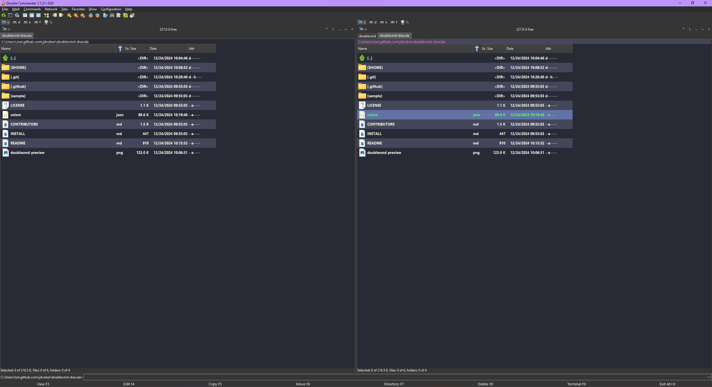

# Dracula for [DoubleCommander](https://github.com/doublecmd/doublecmd)

> A dark theme for [DoubleCmd](https://github.com/doublecmd/doublecmd).



## Install

Copy ```colors.json``` to either:

- The "settings" folder in the program directory (portable version).

- User home directory.

See [here](https://doublecmd.github.io/doc/en/configuration.html#config_files) for more details.

## Community

- [Twitter](https://twitter.com/draculatheme) - Best for getting updates about themes and new stuff.
- [GitHub](https://github.com/dracula/dracula-theme/discussions) - Best for asking questions and discussing issues.
- [Discord](https://draculatheme.com/discord-invite) - Best for hanging out with the community.

## Dracula PRO

[](https://draculatheme.com/pro)

## License

[MIT License](./LICENSE)
